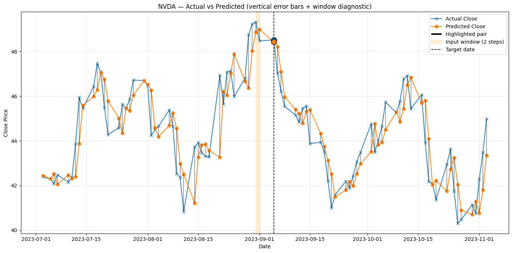
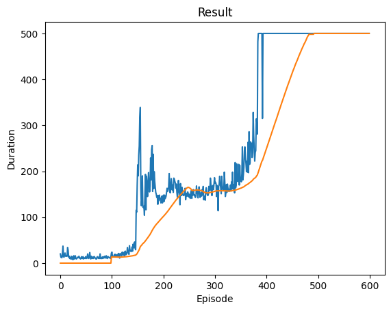
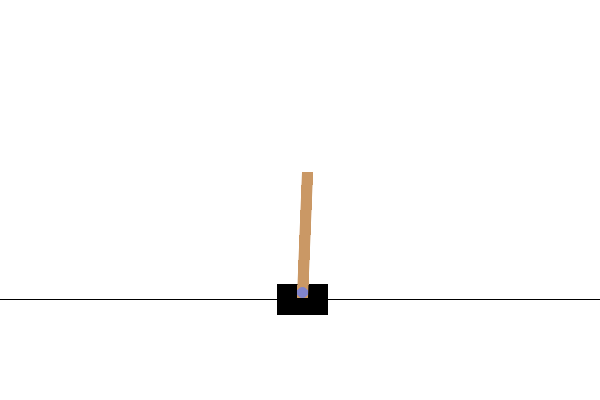

# AI and Machine Learning Projects Repository

> **Warning:** Projects are being migrated to individual repositories. Stay tuned for updates.

Welcome to the **AI and Machine Learning Projects Repository**! This repository is a collection of my personal projects, experiments, and implementations using various Artificial Intelligence (AI), Machine Learning (ML) techniques and frameworks and other fun projects.

## Certifications

Some of my certifications are:

- Microsoft 
   - AI & ML Engineering Professional Certificate
   - Python Development Professional Certificate
- DeepLearning.AI 
   - Natural Language Processing Specialization 
   - Deep Learning Specialization Certificate

See the full list of my courses and professional certificates on my LinkedIn Profile [https://www.linkedin.com/in/devmuniz/details/certifications/](https://www.linkedin.com/in/devmuniz/details/certifications/)

## Included Topics

### **Repos Coming soon**
- AI Research
   - Cerebral Palsy Prediction and Clustering
   - Chest X-Ray Classification and Radiology report generation

### **In progress**

- DINOv3 Interactive Patch Cosine Similarity Viewer 
   - [Github Repo](https://github.com/devMuniz02/DINOv3-Interactive-Patch-Cosine-Similarity)
   - [Hugging Face Space](https://huggingface.co/spaces/manu02/DINOv3-Interactive-Patch-Cosine-Similarity)

### Gradio App [TRY IT NOW](https://huggingface.co/spaces/manu02/DINOv3-Interactive-Patch-Cosine-Similarity)

### Some results

### Computer Vision / Autonomous vehicles
- [Autonomous warehouse car](https://github.com/devMuniz02/Autonomous-warehouse-car) (UDEM)

Use of Hiwonder omnidirectional car and Universal robot UR3e in a warehouse grid-like route.

 
- [QR Reader](https://github.com/devMuniz02/QR-Reader)
- [Car lane detector](https://github.com/devMuniz02/Car-lane-detector/)
- [Image Color Detection](https://github.com/devMuniz02/Image-Color-Detection/)
- [Autonomous Car control](https://github.com/devMuniz02/Autonomous-car-control/)

### **Convolutional Neural Networks (CNN)**
Projects using CNN architectures for image classification, object detection, and other computer vision tasks, with implementations in:
- TensorFlow
- PyTorch

   

### **Generative Modeling**
Projects focused on Generative Adversarial Networks (GANs) for tasks such as:
- Image generation
- Style transfer
Implemented in TensorFlow.

### **Imitation Learning**
Projects exploring Reinforcement Learning techniques applied to imitation learning tasks.

### **Model Optimization**
Techniques for optimizing machine learning models in TensorFlow, including:
- Pruning
- Quantization
- Weight clustering

### **Recurrent Neural Networks (RNN)**
Applications of RNNs for sequence modeling tasks like:
- Time series forecasting (LSTM)
   

- Natural language processing  
   
   <pre>

   
   Starting text:
   Once upon a time

   Generated text:
   of so all that does to something jace like you can find are the own minded what
   me her sit nor have so right so not as everything we have be mind ” sam ” when
   that 'i running down to apollo and much myth was happy ” lies teaches

   Starting text:
   The meaning of life is

   Generated text:
   a things will be ” the pursuing if you mean it ” their way you can take my
   single day it down in breathlessness how ” joy is the best tasted not can even ”
   into a lease or your one natural when taken to wrap the defeats ” the

   Starting text:
   Happiness comes from

   Generated text:
   men ” love that i make someone reading i feel our dna ” with losing the sure ”
   that nothing is to rather and someone to me if i speak that i say anything to be
   half ” ” ” ” in the own way ” i can be no
   </pre>

- [Stock Prediction with LSTM and Sentiment Analysis](https://github.com/devMuniz02/Stock-prediction-LSTM-Sentiment-Analysis-Python)

### **Reinforcement Learning (RL)**
Projects and experiments with RL algorithms for tasks like policy optimization and environment interaction. Implementations include:
- TensorFlow
- PyTorch
   - Cartpole DQN policy

      
      
- Stable Baselines3
   - [Robot 3-DOF Reinforcement learning control](https://github.com/devMuniz02/Robot-3-DOF-Reinforcement-learning-control/)

      - Before Training

      

      - After 100,000 Steps

      

      - After 500,000 Steps

      

   - [Reinforcement-Learning-Stock-Portfolio-Management](https://github.com/devMuniz02/Reinforcement-Learning-Stock-Porfolio-Managment)

### **Transfer Learning**
Projects usign pretained models with transfer learning. Implementations include:
- TensorFlow

## How to Use
1. Clone the repository:
2. Navigate to the folder of interest and explore the projects and notebooks.
3. Ensure you have the required dependencies installed.

## Dependencies
Most projects use popular Python libraries such as:
- TensorFlow
- PyTorch
- NumPy
- Pandas
- Matplotlib
- HuggingFace Transformers
- Stable Baselines3

## Contributions
Contributions are welcome! Feel free to submit a pull request or open an issue if you have ideas for improvements, new projects, or bug fixes.

## License
This repository is licensed under the MIT License. See the [LICENSE](LICENSE) file for more details.

Happy coding!

